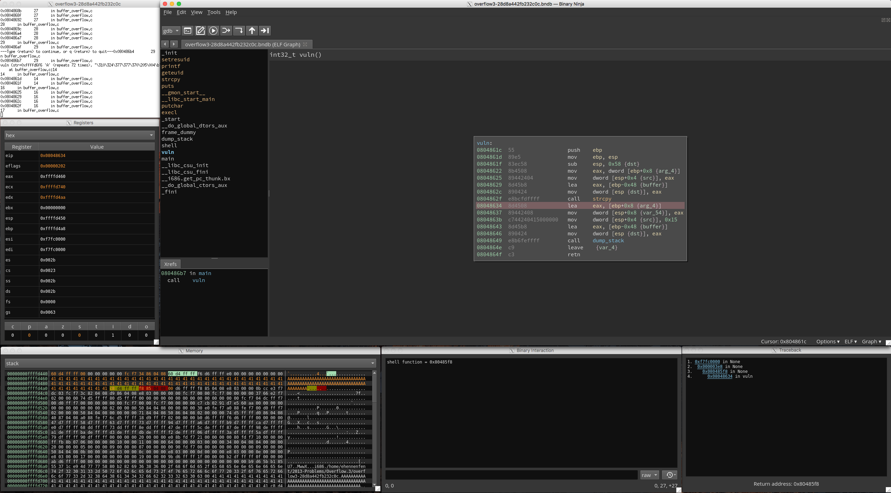

# Binary Ninja Dynamic Analysis Tools

##### This project adds a PyQt5 frontend to the binjatron plugin for Binary Ninja, that includes highlighting features aimed at making it easier for beginners to learn about reverse engineering.

## Motivation
The ability to reverse engineer x86 binaries is an important skill even outside of the information security industry. However, even with the abundance of available training materials, it remains a difficult skill to learn. Many students have expressed frustration with the amount of background knowledge required to make even modest progress on simple binaries.

Binary Ninja is often marketed to students due to its relatively low cost, clean interface, and ease of use. The low-level and medium-level intermediate languages also provide an easy way to understand what instructions do. This project aims to make Binary Ninja an even better tool for beginners by making it easier to visualize the execution of a binary.

## Components
* Debugging via [Binjatron](https://github.com/snare/binjatron)
* Debugger toolbar
* Register viewer
* Stack viewer
* Backtrace viewer

## Origins
This project is a product of [NCC Group](https://www.nccgroup.trust/us/)'s 2017 summer internship program. The visual debugging components can be thought of as a spiritual successor to [Microcorruption](https://microcorruption.com), an embedded security CTF produced by Matasano Security.

## Installation
Inside your [Binary Ninja plugins folder](https://github.com/Vector35/binaryninja-api/tree/master/python/examples#loading-plugins), run:
```bash
git clone https://github.com/ehennenfent/binja_dynamics.git
cd binja_dynamics
./install.sh
```

## Usage
After loading a binary, click the `Enable Dynamic Analysis Tools` item in the tools menu. A debugger window will spawn, which you can control via the buttons on the toolbar. As you steps through execution, the UI will update in real time to reflect the program state. Thanks to Binjatron, the current instruction and any breakpoints are highlighted in the binary view. For each memory address and for the registers, the value is highlighted in orange whenever it has changed as a result of the previous instruction. In a similar vein, the top and bottom of the current stack frame (as well as the predicted location of the return address) are highlighted in order to make it easier for beginners to identify what portions of the memory are important for them to look at. The traceback viewer displays a backtrace of the current stack frames, and provides a button that will automatically jump the binary view to the location given by the memory address where the plugin expects to find the return address. In some functions, the stack frame is not torn down in the way the plugin expects, so this predicted return address may not always be correct.



## Highlighting
(In the above screenshot, the base pointer is shown in olive green)
* Current instruction - red
* Breakpoint - blue
* Memory or register changed - orange text
* Stack pointer - light green
* Base pointer - light blue
* Predicted return address - red
* Instruction pointer (where applicable) - bright red

## Documentation

#### Code
On occasion, it may be necessary to consult the source code to understand the exact behavior of the interfaces. In anticipation of this, many of the design decisions and implementation details are explained in inline comments.

#### Wiki
The [wiki](https://github.com/ehennenfent/binja_dynamics/wiki) is still relatively sparse, but content such as the list of stumbling blocks and the development log may be of use in troubleshooting.

#### Examples
Consider consulting [the `binja_sensei` repo](https://github.com/ehennenfent/binja_sensei#writeups) for examples that may aid you in getting started.

## Current Limitations
* Currently, only x86(64) Linux binaries are supported. Even with that limitation, there may be binaries that behave in a way that binja_dynamics or Voltron can't handle. You are encouraged to file a pull request or an issue with any errors you encounter.
* binja_dynamics has only been tested on Ubuntu 16.04. While Windows support is likely out of the question due to the way terminal redirection works, it may be possible to get reasonable functionality on other unix platforms. Once again, pull requests and issues are welcome.
* Since Binary Ninja and binjatron are based on Python 2.7, the version of GDB that ships with Ubuntu must be replaced with a version that supports Python 2.7 before binja_dynamics is installed. The install script has been found to do this successfully on a fresh Ubuntu 16.04 VM, but updates to GDB, updates to Ubuntu, or preinstalled components (if you're not installing on a fresh VM) may break it.
* For performance reasons, the memory viewer only displays the contents of the stack and BSS segments.
* See [Issues](https://github.com/ehennenfent/binja_dynamics/issues) for more

## Third-party Content
* binja_dynamics makes use of a [fork](https://github.com/ehennenfent/hexview) of [qthexedit](https://github.com/csarn/qthexedit), which is licensed under GPLv2.
* The images used for icons are licensed under Creative Commons. See [attribution.txt](https://github.com/ehennenfent/binja_dynamics/blob/master/attribution.txt) for information on the sources.

## Requirements
* [binjatron](https://github.com/snare/binjatron)
* [binja_toolbar](https://github.com/ehennenfent/binja_toolbar)
* [binja_spawn_terminal](https://github.com/ehennenfent/binja_spawn_terminal.git)
* [voltron](https://github.com/snare/voltron)
* PyQt5
* Binary Ninja

Excluding Binary Ninja, `install.sh` will handle these dependencies for you.
